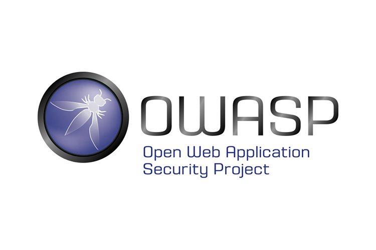

# OWASP Top 10

Dans le monde de la cybersécurité, OWASP \(**Open Web Application Security Project\)** est incontournable. Une organisation à but non lucratif travaillant sur la sécurité des applications Web, sa philosophie est de rester open source et accessible à tous. Un de ses projets les plus connu vous sera présenté dans cet article.

Le projet OWASP Top 10 \([https://owasp.org/www-project-top-ten/](https://owasp.org/www-project-top-ten/)\) est de fournir une liste des dix risques de sécurité les plus critiques affectant les applications web. Il est actuellement une référence dans le domaine de la sécurité informatique, il sensibilise autant les développeurs que les entreprises. La dernière mise à jour de ce classement a été faite en 2017 :

1. [**Injection**](https://owasp.org/www-project-top-ten/2017/A1_2017-Injection). Des failles d'injection, telles que l'injection SQL, NoSQL, OS et LDAP, se produisent lorsque des données non approuvées sont envoyées à un interpréteur dans le cadre d'une commande ou d'une requête. Les données hostiles de l'attaquant peuvent inciter l'interpréteur à exécuter des commandes involontaires ou à accéder aux données sans autorisation appropriée.
2.  [**Broken Authentication**](https://owasp.org/www-project-top-ten/2017/A2_2017-Broken_Authentication). Les fonctions applicatives liées à l'authentification et à la gestion de session sont souvent mal implémentées, permettant aux attaquants de compromettre les mots de passe, les clés ou les jetons de session, ou d'exploiter d'autres failles d'implémentation pour assumer temporairement ou définitivement l'identité des autres utilisateurs.
3.  [**Sensitive Data Exposure**](https://owasp.org/www-project-top-ten/2017/A3_2017-Sensitive_Data_Exposure). De nombreuses applications Web et API ne protègent pas correctement les données sensibles, telles que les données financières, les soins de santé et les informations personnelles. Les attaquants peuvent voler ou modifier ces données faiblement protégées pour mener une fraude par carte de crédit, un vol d'identité ou d'autres crimes. Les données sensibles peuvent être compromises sans protection supplémentaire, telle que le cryptage au repos ou en transit, et nécessitent des précautions particulières lorsqu'elles sont échangées avec le navigateur.
4.  [**XML External Entities \(XXE\)**](https://owasp.org/www-project-top-ten/2017/A4_2017-XML_External_Entities_%28XXE%29). De nombreux processeurs XML plus anciens ou mal configurés évaluent les références d'entités externes dans les documents XML. Les entités externes peuvent être utilisées pour divulguer des fichiers internes à l'aide du gestionnaire d'URI de fichier, des partages de fichiers internes, de l'analyse des ports internes, de l'exécution de code à distance et des attaques par déni de service.
5.  [**Broken Access Control**](https://owasp.org/www-project-top-ten/2017/A5_2017-Broken_Access_Control). Les restrictions sur ce que les utilisateurs authentifiés sont autorisés à faire ne sont souvent pas correctement appliquées. Les attaquants peuvent exploiter ces failles pour accéder à des fonctionnalités et / ou des données non autorisées, telles que l'accès aux comptes d'autres utilisateurs, afficher des fichiers sensibles, modifier les données d'autres utilisateurs, modifier les droits d'accès, etc.
6.  [**Security Misconfiguration**](https://owasp.org/www-project-top-ten/2017/A6_2017-Security_Misconfiguration). Une mauvaise configuration de la sécurité est le problème le plus courant. Cela est généralement le résultat de configurations par défaut non sécurisées, de configurations incomplètes ou ad hoc, d'un stockage dans le cloud ouvert, d'en-têtes HTTP mal configurés et de messages d'erreur détaillés contenant des informations sensibles. Non seulement tous les systèmes d'exploitation, frameworks, bibliothèques et applications doivent être configurés en toute sécurité, mais ils doivent également être corrigés / mis à niveau en temps opportun.
7.  [**Cross-Site Scripting \(XSS\)**](https://owasp.org/www-project-top-ten/2017/A7_2017-Cross-Site_Scripting_%28XSS%29). Des failles XSS se produisent chaque fois qu'une application inclut des données non approuvées dans une nouvelle page Web sans validation ou échappement appropriée, ou met à jour une page Web existante avec des données fournies par l'utilisateur à l'aide d'une API de navigateur qui peut créer du HTML ou du JavaScript. XSS permet aux attaquants d'exécuter des scripts dans le navigateur de la victime qui peuvent détourner les sessions des utilisateurs, dégrader des sites Web ou rediriger l'utilisateur vers des sites malveillants.
8.  [**Insecure Deserialization**](https://owasp.org/www-project-top-ten/2017/A8_2017-Insecure_Deserialization). Une désérialisation non sécurisée conduit souvent à l'exécution de code à distance. Même si les failles de désérialisation n'entraînent pas l'exécution de code à distance, elles peuvent être utilisées pour effectuer des attaques, y compris des attaques de relecture, des attaques par injection et des attaques par élévation de privilèges.
9.  [**Using Components with Known Vulnerabilities**](https://owasp.org/www-project-top-ten/2017/A9_2017-Using_Components_with_Known_Vulnerabilities). Les composants, tels que les bibliothèques, les frameworks et d'autres modules logiciels, s'exécutent avec les mêmes privilèges que l'application. Si un composant vulnérable est exploité, une telle attaque peut faciliter de graves pertes de données ou une prise de contrôle du serveur. Les applications et les API utilisant des composants avec des vulnérabilités connues peuvent saper les défenses des applications et permettre diverses attaques et impacts.
10.  [**Insufficient Logging & Monitoring**](https://owasp.org/www-project-top-ten/2017/A10_2017-Insufficient_Logging%2526Monitoring). Une journalisation et une surveillance insuffisantes, associées à une intégration manquante ou inefficace avec la réponse aux incidents, permettent aux attaquants d'attaquer davantage les systèmes, de maintenir la persistance, de basculer vers plus de systèmes et de falsifier, extraire ou détruire les données. La plupart des études sur les violations montrent que le temps de détection d'une violation est supérieur à 200 jours, généralement détecté par des parties externes plutôt que par des processus ou une surveillance internes.

Ce n'est pas le seul projet d'OWASP et pourtant un des plus reconnu sur la sécurité des applications web.

