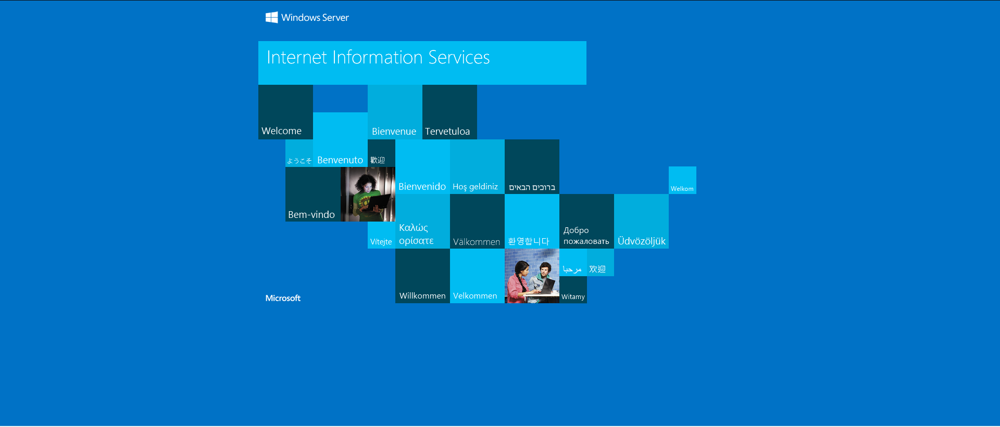
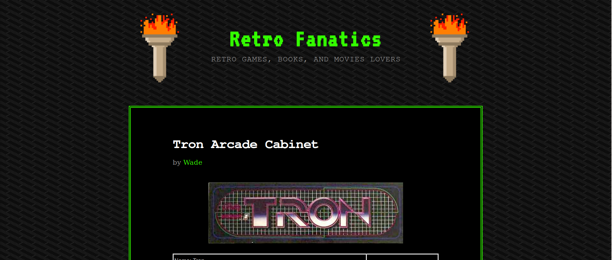
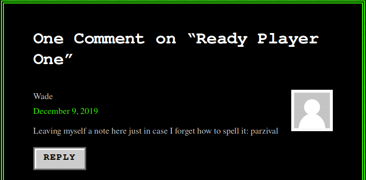
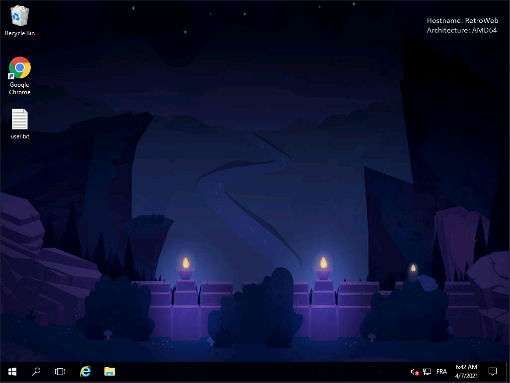
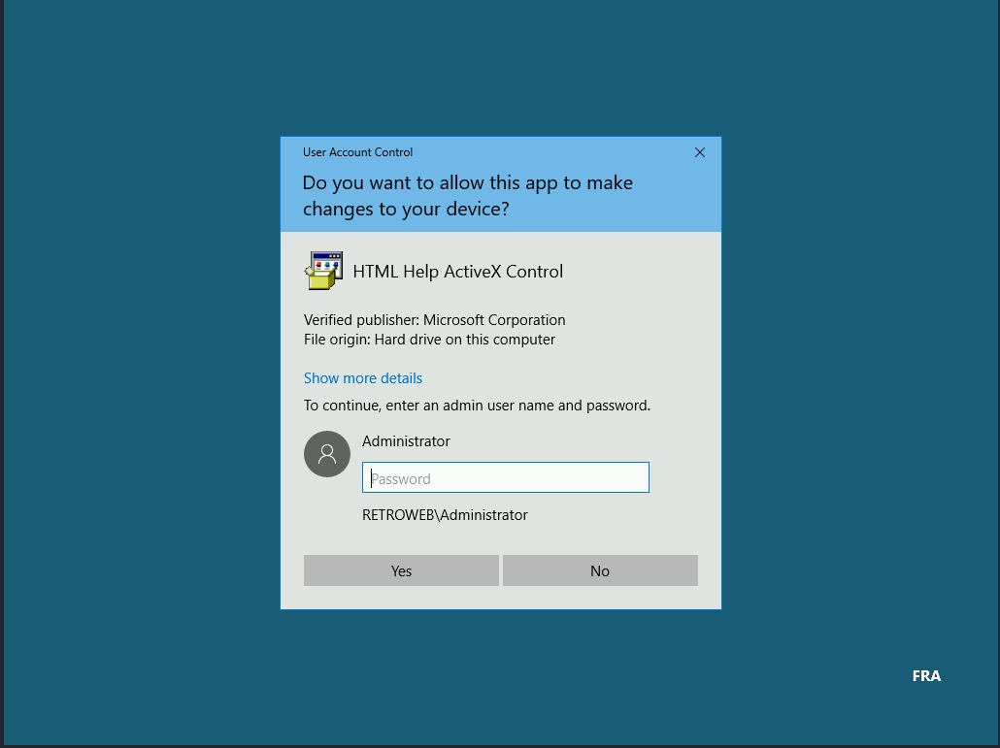
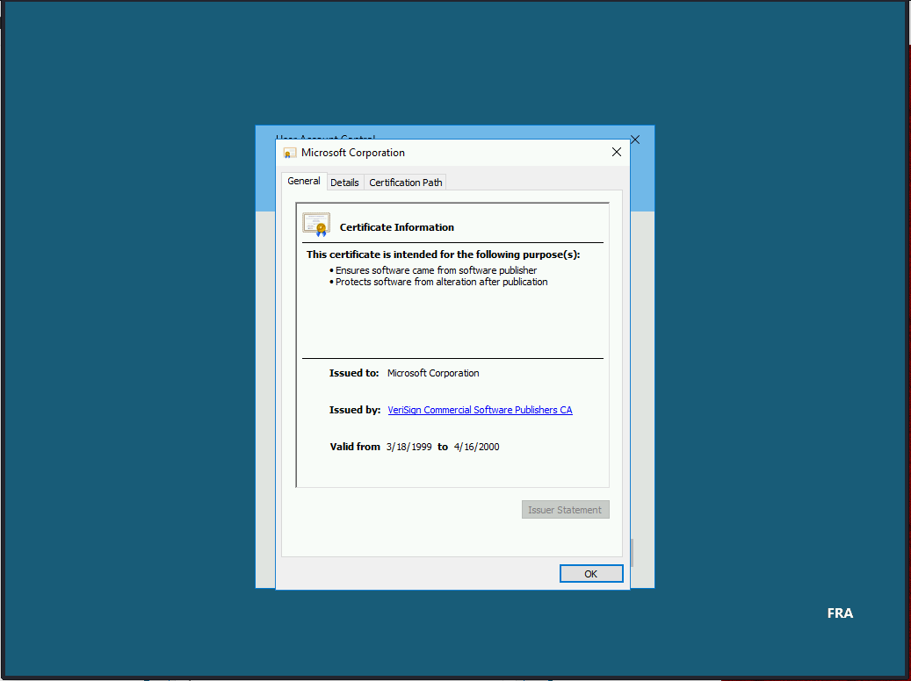

# TryHackMe - Retro

Le CTF "Retro" est disponible sur la plateforme TryHackMe et a la difficulté "hard" (i.e. difficile en français). Nous allons décomposer le Write-Up selon les étapes suivantes :

1. Enumeration ;
2. Exploitation ;
3. Escalation de privilège .

&#x20;Nous allons devoir trouver les flags sur un serveur web basé sur Windows.


MACHINE\_IP représente l'IP de la machine "Retro".


### 1/ Enumeration

Il faut premièrement énumérer les ports ouverts via Nmap.

```
$ nmap -Pn -sV MACHINE_IP

PORT     STATE SERVICE       VERSION
80/tcp   open  http          Microsoft IIS httpd 10.0
3389/tcp open  ms-wbt-server Microsoft Terminal Services
Service Info: OS: Windows; CPE: cpe:/o:microsoft:windows
```

Deux ports sont ouverts, le port 80 et 3389. Concentrons-nous en premier sur le serveur web (port 80), voici la page principale :&#x20;



Nous allons à présent utiliser Gobuster (Dirsearch et Dirbuster fonctionnent également) afin de trouver les autres pages :&#x20;

```
$ gobuster dir -u http://MACHINE_IP -w /usr/share/dirb/wordlists/big.txt
===============================================================
Gobuster v3.0.1
by OJ Reeves (@TheColonial) & Christian Mehlmauer (@_FireFart_)
===============================================================
[+] Url:            http://10.10.207.134
[+] Threads:        10
[+] Wordlist:       /usr/share/dirb/wordlists/big.txt
[+] Status codes:   200,204,301,302,307,401,403
[+] User Agent:     gobuster/3.0.1
[+] Timeout:        10s
===============================================================
2021/04/07 09:01:21 Starting gobuster
===============================================================                                                   
/retro (Status: 301)
===============================================================
2021/04/07 09:03:43 Finished                                                                                      
=============================================================== 
```

Nous avons trouvé la page `/retro` après l'énumération. Voici à quoi ressemble la page :



On remarque que les articles du site sont tous écrits par Wade, en allant voir son profil, il est possible de voir ses derniers posts. En allant sur son post "Ready Player One" on aperçoit un commentaire écrit par lui-même contenant ce message :&#x20;



En énumérant la page `/retro`, nous retrouvons une page permettant de se connecter à une page WordPress, vous pouvez continuer via WordPress pour la suite, nous ne verrons pas cette partie dans ce write-up. L'énumération est terminée, bravo à vous si vous avez réussi jusqu'ici !&#x20;

### 2/ Exploitation

Revenons sur le port 3389 en utilisant les informations trouvées précédemment.

Nous savons que Wade est le seul utilisateur qui poste sur le site, nous savons qu'il a laissé "parzival" de côté pour s'en souvenir, utilisons ces informations afin de nous connecter en RDP à la machine :

`$ xfreerdp /v:MACHINE_IP /u:wade /p:parzival`




Bravo ! Nous avons trouvé le fichier user.txt : fbdc6d430bfb51 (incomplet)

### 3/ Escalation de privilège

Dans l'historique de Chrome, on s'aperçoit que la page d'une CVE a été ouverte (CVE-2019-1388). Or dans la corbeille, il y a un fichier, que vous devrez restaurer. Une fois cette étape finie, lancez-le, cette page s'affichera :&#x20;



Cliquez sur "Show more details" puis sur "Show information about the publisher’s certificate.". Cette page apparaîtra :&#x20;



Cliquez sur le lien de "Issued By:", puis choisissez Internet Explorer pour l'ouvrir. Vous recevrez ensuite un message d'erreur : &#x20;


À présent, faites "CTRL+S" afin d'aller dans le chemin : `C:\Windows\System32\`Descendez dans le dossier pour trouver l'invite de commande (cmd), puis ouvrez-le. Il sera ouvert en tant d'administrateur (System32) :


Pour trouver le fichier root.txt, écrivez :&#x20;

`type ..\..\Users\Administrator\Desktop\root.txt`

Bravo à vous, si vous avez réussi à trouver tous les flags !&#x20;
