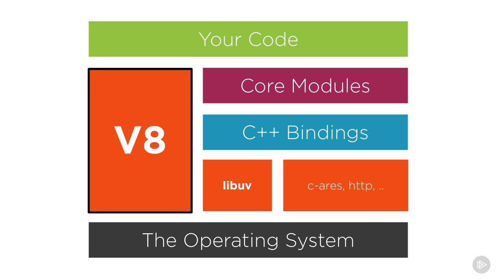

# La famille JS, TS

@flov220 : [https://developer.mozilla.org/fr/docs/Web/JavaScript](https://developer.mozilla.org/fr/docs/Web/JavaScript)

єtђгค๓ : [https://www.youtube.com/watch?v=02Xs2ySaXcs&list=PLrSOXFDHBtfGxf\_PtXLu\_OrjFKt4\_dqB\_](https://www.youtube.com/watch?v=02Xs2ySaXcs&list=PLrSOXFDHBtfGxf_PtXLu_OrjFKt4_dqB_)

@Léolios : La suite sera ici pour apprendre le TypeScript : [https://www.grafikart.fr/tutoriels/typescript-781](https://www.grafikart.fr/tutoriels/typescript-781)

@Thomas :Certains ont peut-être déjà vu ce site mais je le poste tout de même. C'est un article regroupant les notions avancées de Typescript \(ça peut vite être hardcore, une bonne maîtrise du langage est donc nécessaire à la compréhension de ces différentes notions\) : [https://fettblog.eu/advanced-typescript-guide/](https://fettblog.eu/advanced-typescript-guide/)

@Léolios :  Node ressemble à ça :

 Le moteur V8 est présent aussi dans les navigateurs pour exécuté du JS. En réalité y a pas de meilleurs langage, juste suivant le contexte il peut être plus approprié. On le retrouve aussi dans Deno.

\[**Développeur avancé**\] - POO requis. 

Pour ceux qui sont avancé comme @Thomas @Axone ... Je vous recommande un site pour apprendre la suite à la POO sur les patrons de conceptions \(**design pattern**\).

> Refactoring.Guru vous facilite l’accès à tout ce que vous devez savoir sur la refactorisation, les patrons de conception, les principes **SOLID**, et d’autres sujets intéressants de la l'architecture et de la programmation.

 Le site est vraiment complet je n'ai rien à redire. 

Pour typeScript cela sera le lien : [https://refactoring.guru/fr/design-patterns/typescript](https://refactoring.guru/fr/design-patterns/typescript)

C'est en trois parties @Thomas Node vs Deno: **Synopsis**

> Deno est un runtime simple, moderne et sécurisé pour JavaScript et TypeScript qui utilise le moteur JS V8 de Google. Deno est construit en Rust. Deno est sécurisé, fonctionne en mode "sandbox", exécute le script typographique dès sa sortie de la boîte et est livré sous la forme d'un seul fichier exécutable. En plus d'exécuter une application de type script, Deno comprend également un testeur, un formateur, un linter, un inspecteur, etc. Deno est plus qu'un simple moyen d'exécuter des applications Typescript. Deno est une chaîne d'outils complète.



Petit complément : [https://mayankchoubey.github.io/Deno-vs-Node-Performance/](https://mayankchoubey.github.io/Deno-vs-Node-Performance/)

