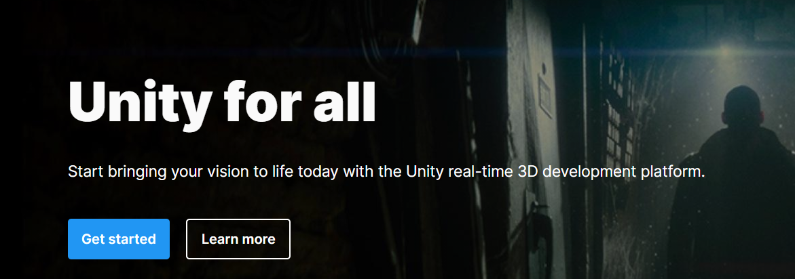
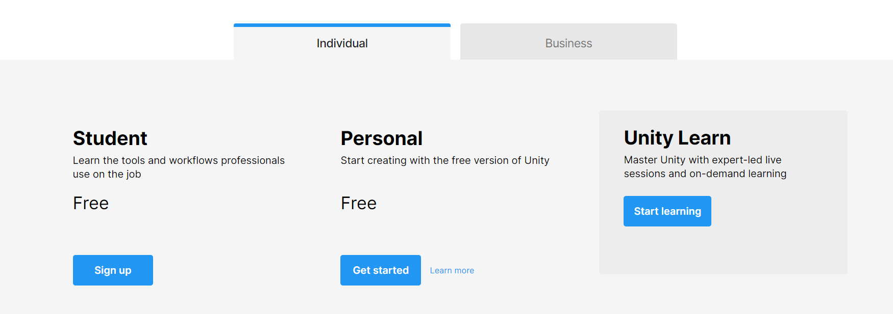

# Unity

## Introduction

### Installation de unity et la configuration

Pour commencé a créé des jeux sur Unity. Il faut le télécharger.

1.D'abord aller sur le site officille de Unity \([https://unity.com/](https://unity.com/)\).

2.Appuyez sur "Get started".

Vous pourriez choisir entre business & individual. Pour commencer je vous propose individual pour ce guide .

3.Choisissez "Personal".

4.Vous allez avoir une page ou vous allez avoir un bouton "Stort here" et le téléchargement commence.

### Qu'est ce qu'on va faire et pour qui est ce guide?

Ce guide est pour le gens qui veulent commencé a créé des jeux mais ne savent pas comment commencer. Dans ce guide je vais vous apprendre a créé un jeu trés simple, grace a ce jeu vous aurriez après ce guide la base pour commencé a faire du dévelloppement sur Unity.

Unity utilise La langue C\#. Je vais commencé le guide a 

## Le C\#

* Pourquoi apprendre C\# ?
* La base du C\#
* 
### 

