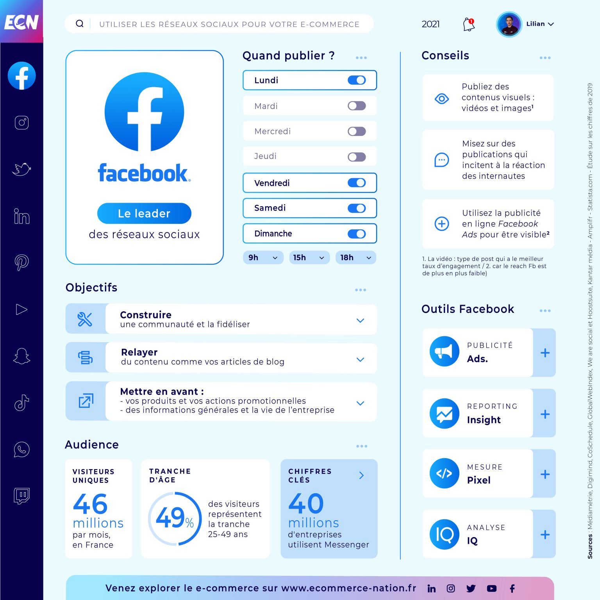
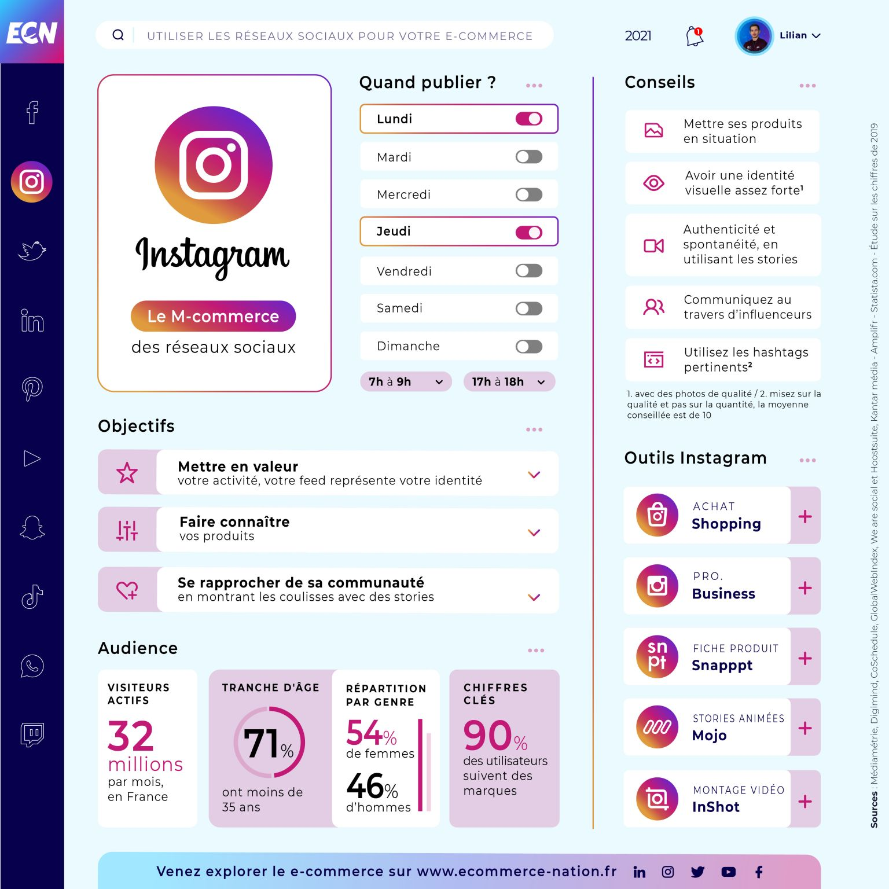
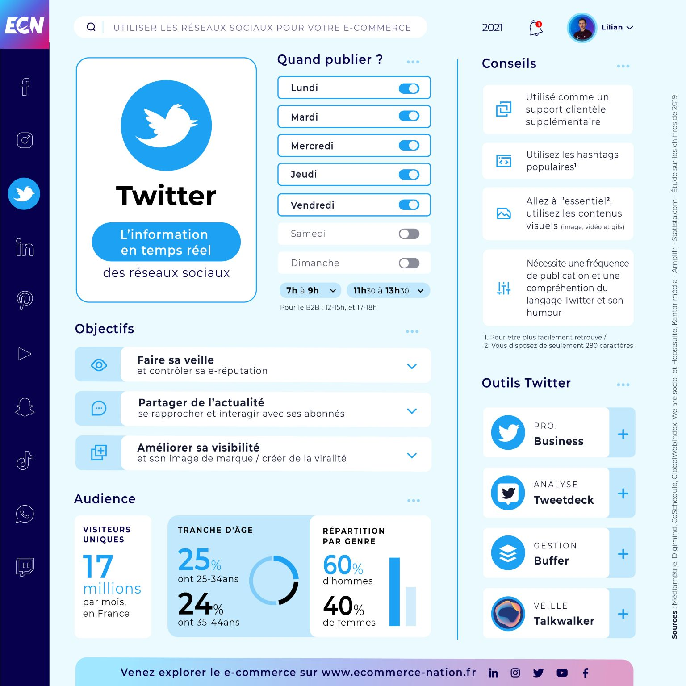
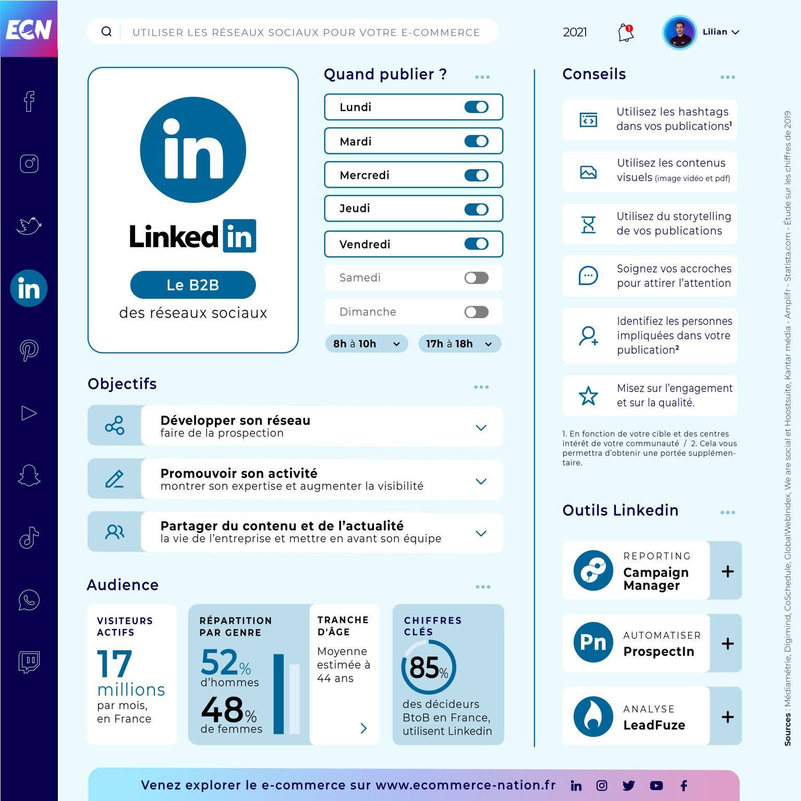
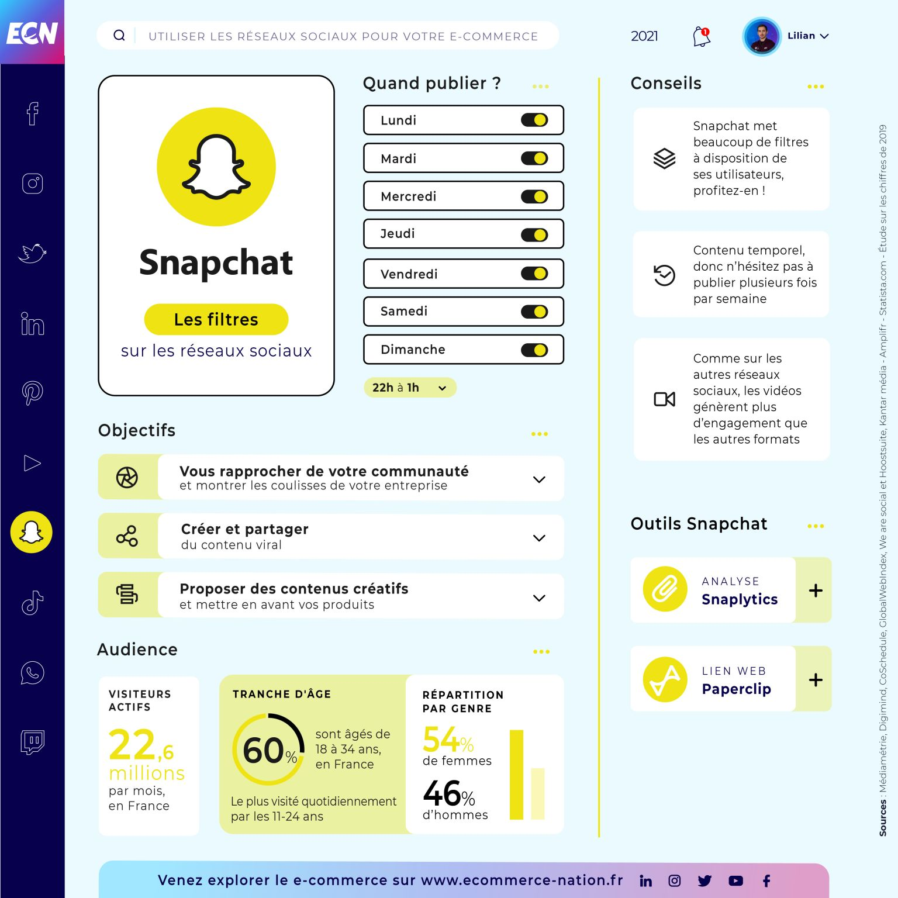
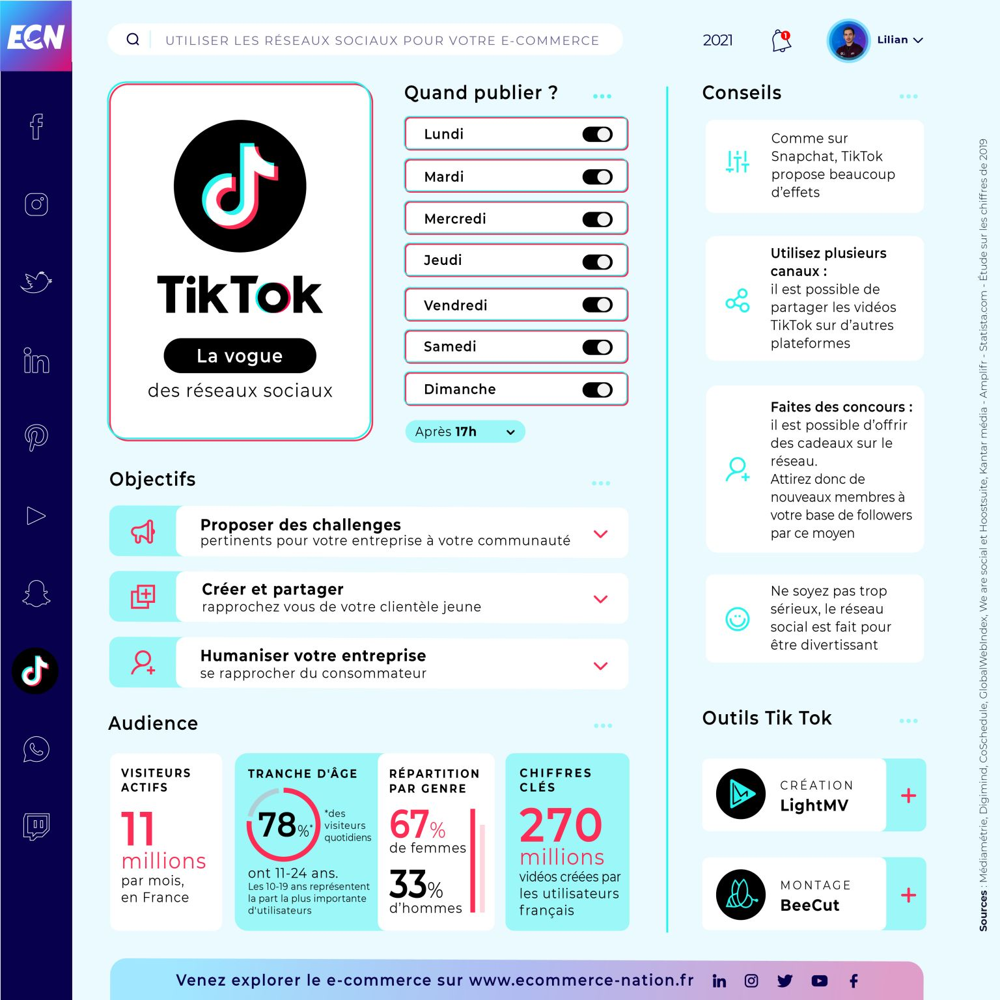
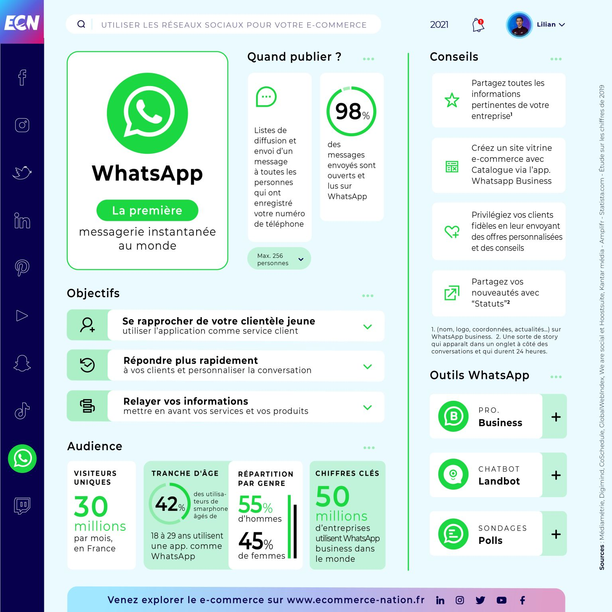
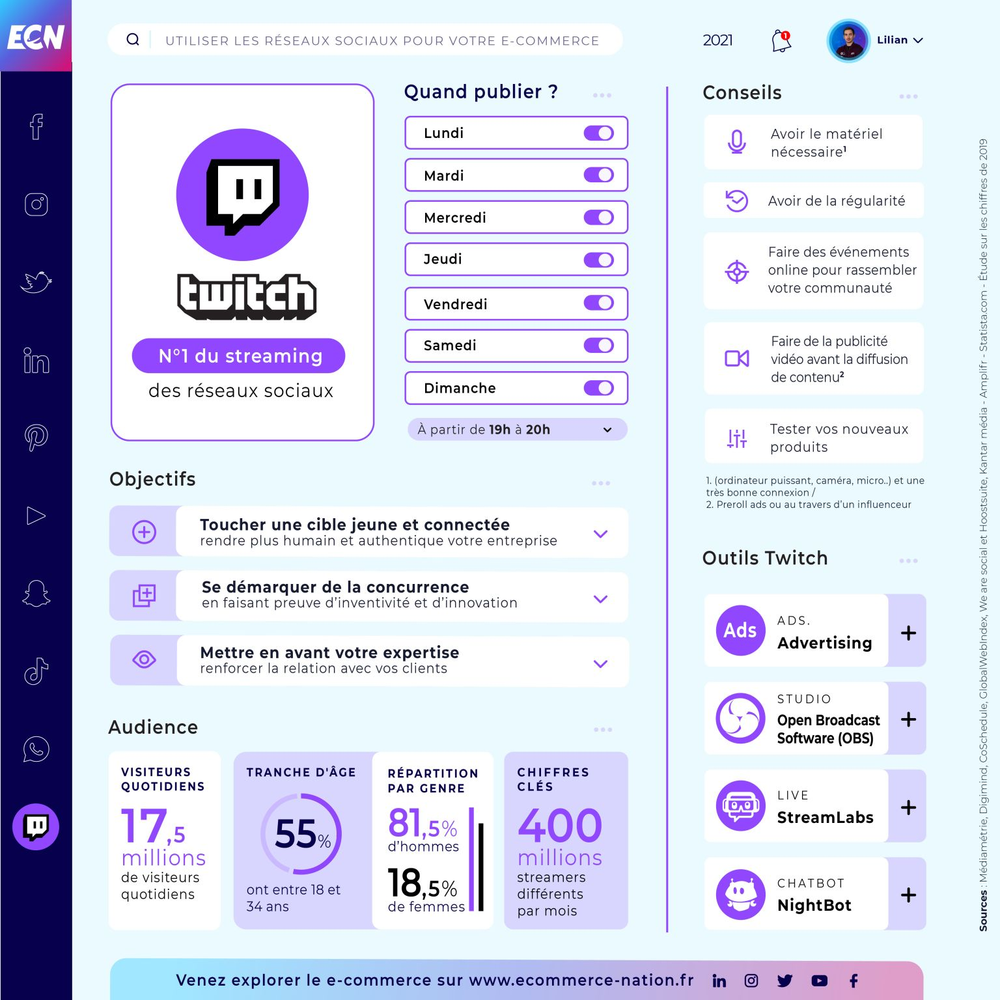

# Tips sur les réseaux sociaux 2021

🔎 Vous voulez savoir les chiffres clés, l'audience, les objectifs, les conseils et les outils des réseaux sociaux, tout est ici 🙂

L'entreprise Européen **E-Commerce Nation** à mis en ligne plusieurs informations dont un pdf de l'étude complète sur les réseaux sociaux avec un top 100 des e-boutiques, en plus des informations très utile à connaitre lorsqu'on utilise les réseau régulièrement en tant que publieur.


Etude des reseaux sociaux top 100 Ecommerce


## Facebook

## Instagram

## Twitter

## Linkedin

## Pinterest

 (1) (1).jpeg>)

## Snapchat

## TikTok

## Whatsapp ( complémentaire )

## Twitch

## Pour en savoir plus et aller plus loin :



