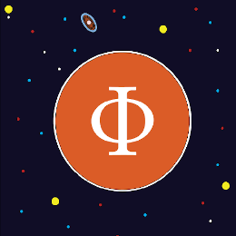

# 💻 Azales

Passionné de l'univers informatique plus particulièrement du développement. J'ai décidé de monter une chaîne YouTube afin d'aborder le très jeune langage **RUST**, qui devient de plus en plus populaire. Au cours de mon autodidaxie, j'ai développé un certain nombre de pratique du langage et je souhaitais les restituer, parce-qu'il existe très peu d'informations sur ce langage en français. Au fur et à mesure, je montrerai d'autre choses et des concepts plus avancés.

Depuis, j'ai rejoint la communauté dont je suis l'un des administrateurs, nous nous amusons tous ensemble tels des passionnés de technologie uniquement pourraient le faire. Il est possible que je rejoigne le conseil d'administration de **BlueKeys** qui soutient en plus du développement et de la cybersécurité, les aspects de préventions contre la cyber-malveillance sur les réseaux, ce qui est important pour moi.

## [▶️](https://emojipedia.org/youtube/) Youtube


Ma chaîne youtube


## [👅](https://emojiterra.com/fr/langue/) Langue (La mienne :P)


Je suis en train de créer une langue


## 💻 Mon site web


Mon site web avec mes informations et mon manga Black screen !


