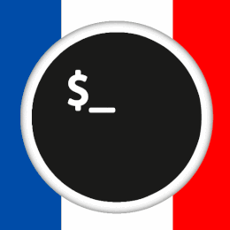

# 🛡️ FCC \(French Communuty Cybersecurity\)

Bonjour à tous ,

Nous nous présentons trois personnes passionnées par la cybersécurité que voici :

* TenShi, 18 ans passionné d'hacking éthique et d'informatique en général , a l'ambition de transmettre ses connaissances pour aider la majorité à commencer.
* Leslato, 24 ans, Ancien élève de 42 Paris propose des cours gratuits en C et aide à débuter dans le monde de la cybersécurité.
* Jeje, 20 années, passe son temps libre à programmer ou à faire des CTF ... sinon s’intéresse beaucoup à l'osint et au social engineering.

TenShi a créé le discord récemment sur le sujet de la CyberSecurity qui se nomme FCC.

Cette communauté a pour but de vous aider **VOUS** à débuter en mettant à votre disposition des dizaines de ressources uniques et des cours de programmation. Tout cela sera bien évidemment un partage sans but lucratif pour votre bonheur🤩 

Avec mes collaborateurs Leslato et Jeje, nous avons fait grandir cette communauté naissante.

Si vous hésitez encore à nous rejoindre n'oubliez pas que tout le monde est le bienvenue et que les débutants sont poussés vers le haut grâce à des experts qui travaillent dans le domaine ou encore des étudiants dans de nombreuses écoles informatiques différentes pour vous soutenir et vous aider.

Attention l'éthique est notre valeur la plus importante et elle doit être respectée sous peine de sanction immédiate.

## Rejoignez-nous 



A bientôt sur la communauté l'ami ! 

