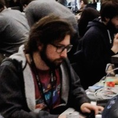
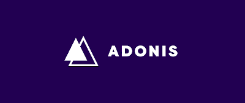

# Romain Lanz

Romain est un passionné de technologie et de e-sport venant tout droit de Suisse. Il est actuellement développeur et administrateur système à la Fédération Internationale de Volleyball. C'est une personne présente dans différentes communautés informatique afin de contribuer et partager son expérience du développement logiciel. Il est également membre honorable du [Lausanne-Sport Esports](https://twitter.com/lausanneesports) mais aussi membre de la core team [d'AdonisJS](https://adonisjs.com). Vous pouvez le croiser sur un message ou vocal Discord, éventuellement s'il est disponible et sur demande il peut venir en vocal pour échanger sur le framework voir même accompagner sur l'utilisation de ce dernier comme un véritable développeur advocate.

[AdonisJS](https://adonisjs.com) est un framework MVC pour Node.js. Il offre un écosystème stable pour écrire des applications web côté serveur, ce qui vous permet de vous concentrer sur les besoins métier de l'entreprise plutôt que sur l'architecture logiciel de celle-ci. Il favorise l'expérience de développement, la stabilité et la rapidité avec une API cohérente et expressive pour construire des applications web complètes ou des micro-serveurs d'API.

## :flag\_ax: Le framework



## :nerd: Github



## 💻 Site



## Discord

Romain Lanz 🦊#0042

## :newspaper:Twitter



