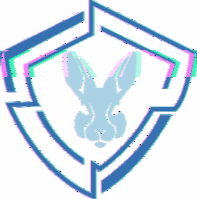

# ℹ️ Qui sommes nous ?

Qu'est-ce que **BlueKeys** ? C'est une **association** immatriculée le 23 février 2021 en Gironde

C’est un espace d'échange, d'orientation, d'écoute, de conseils pour les personnes, entreprises numériques et leurs alliées, elle fait aussi de la prévention contre toutes formes de cybermalveillances et son action sur tout réseau informatique, réel ou supposé, et propose des services informatiques pour tout.e.s. Un autre point important, des dons sont reversés aux hôpitaux des enfants.  
  
Tu aimes le dev, cybersec, voire d'autres choses ? Tu es harcelé ? Rejoins notre espace associatif d'orientation, d'écoute, de conseils tout niveau dans le numérique.

### Citations

> ”Le radium ne doit enrichir personne. C'est un élément; c'est pour tout le monde. ” 
> ”Vous ne pouvez pas espérer construire un monde meilleur sans améliorer les individus.”  
> ”Pensez à être moins curieux des personnes que de leurs idées.” 
> ”Dans la vie, rien n’est à craindre, tout est à comprendre.”

**Marie Curie** 💕

> “Je n’ai pas échoué. J’ai simplement trouvé 10.000 solutions qui ne fonctionnent pas.”

**Thomas Edison** 💕

## Un pourboire ?


Vous pouvez nous laisser un pourboire directement sur nos sites web depuis le navigateur 

**Brave**




## 🔗En savoir +

Email : contact@bluekeys.org

### 💗 Etat de nos services : 



### 🗣 Messagerie instantané



### 💕 Site association \( **en cours** \) : 



### 👨💻 Github



### 🎶 TikTok



### Discord



###  🎁 Tipeee



