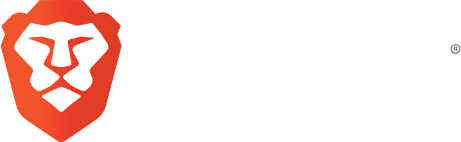

# 📖 Qui sommes-nous ?

 (3) (3) (3) (3).png>)



**Bluekeys** est une **association** de février 2021 en Gironde. Elle se propose d'être un pont entre les jeunes usagers du numérique (12-30 ans) et ceux moins familiers avec ces pratiques, pour une meilleure compréhension des informations et comportements à risques numériques, dans la suite des solutions sont proposées.


Orienter et accompagner les usagers pour ne plus être seul derrière les écrans soit en individuel à NumITe, à domicile et dans les établissements publics.



Chaque équipement donné par NumITe est inscrit dans notre pôle de recyclage numérique pour en faire une seconde vie et l'offrir :gift:




Le présent guide est réalisé pour donner plusieurs orientations suivant un contexte avec certaines ressources, afin d'apporter une information sur des questions auxquelles nous répondons souvent depuis 6 mois en 2020 sur nos différents réseaux.

Tous les articles du présent guide écrits pas nos différents contributeurs (bénévoles, amateurs, étudiants dans le supérieur, CEO ...) sont sous la licence   <mark style="color:orange;">**Attribution 4.0 International (CC BY 4.0)**</mark>, disponible sur notre dépôt numérique pour votre usage soit en clonant le projet ou préférer télécharger la version final trimestriel au format markdown :&#x20;








<mark style="color:blue;">****</mark>[<mark style="color:blue;">**NumITe**</mark>](https://numite.fr/) à Saint-andre-de-cubzac en gironde 33, anciennement depuis 2004 Dom'Micro dans le dépannage et le service informatique aux particuliers et entreprises.\
\
En 2022, vers une croissance pour définir ce qu'est l'artisanat numérique en gironde correspond à de nombreux domaines, nous ne savons pas votre problématique à l'avance et nous irons ensemble vers une solution. Nous détaillerons prochainement nos pôle d'activités



> ”Le radium ne doit enrichir personne. C'est un élément; c'est pour tout le monde. ”\
> ”Vous ne pouvez pas espérer construire un monde meilleur sans améliorer les individus.”\
> ”Pensez à être moins curieux des personnes que de leurs idées.”\
> ”Dans la vie, rien n’est à craindre, tout est à comprendre.”
>
> **Marie Curie** 💕

> “Je n’ai pas échoué. J’ai simplement trouvé 10.000 solutions qui ne fonctionnent pas.”
>
> **Thomas Edison** 💕



|                  📲                  |                          ✍🏻                          |                                📍                               |
| :----------------------------------: | :---------------------------------------------------: | :-------------------------------------------------------------: |
| ​[06.22.68.54.68](tel:+33622685468)​ | [contact@bluekeys.org](mailto:contact@bluekeys.org/)​ | [​Itinéraire à Bluekeys](https://goo.gl/maps/3H7ADWbLeALJK8jU7) |

\
