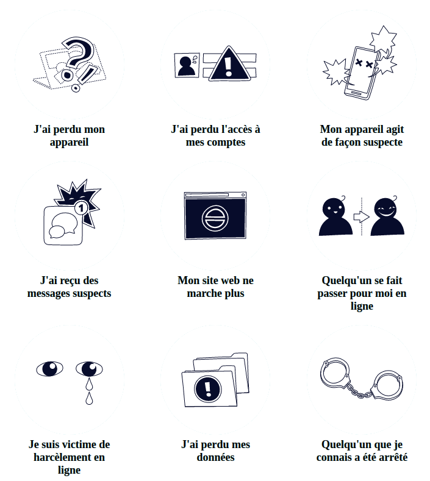

# ❤️‍🩹Kit d'aide digital

La trousse de premiers soins numériques est une ressource gratuite pour aider les intervenants du réseau de réponses rapides, les formateurs en sécurité numérique et les activistes amateurs de technologies à mieux se protéger et à mieux protéger les communautés qu'ils soutiennent contre les types les plus courants d'urgences numériques. Elle peut également être utilisée par les militants, les défenseurs des droits humains, les blogueurs, les journalistes ou les activistes dans les médias qui veulent en savoir plus sur la façon dont ils peuvent se protéger et soutenir les autres. Si vous ou quelqu'un que vous aidez éprouvez une urgence numérique, la trousse de premiers soins numérique vous guidera dans le diagnostic des problèmes auxquels vous faites face et vous dirigera vers des soutiens pour obtenir de l'aide si besoin.

La trousse de premiers soins numériques est le fruit d'une collaboration entre le [RaReNet \(Rapid Response Network\)](https://www.rarenet.org/) et le [CiviCERT](https://www.civicert.org/), est également un projet [open-source qui accepte des contributions extérieures](https://gitlab.com/rarenet/dfak).

Si vous souhaitez utiliser la trousse de premiers soins numériques dans des contextes où la connectivité est limitée, vous pouvez [télécharger une version hors ligne ici](https://www.digitalfirstaid.org/dfak-offline.zip).



[  
J'ai perdu mon appareil](https://digitalfirstaid.org/fr/topics/lost-device)[J'ai perdu l'accès à mes comptes](https://digitalfirstaid.org/fr/topics/account-access-issues)[Mon appareil agit de façon suspecte](https://digitalfirstaid.org/fr/topics/device-acting-suspiciously)[J'ai reçu des messages suspects](https://digitalfirstaid.org/fr/topics/suspicious-messages)[Mon site web ne marche plus](https://digitalfirstaid.org/fr/topics/website-not-working)[Quelqu'un se fait passer pour moi en ligne](https://digitalfirstaid.org/fr/topics/impersonated)[Je suis victime de harcèlement en ligne](https://digitalfirstaid.org/fr/topics/harassed-online)[J'ai perdu mes données](https://digitalfirstaid.org/fr/topics/lost-data)[Quelqu'un que je connais a été arrêté](https://digitalfirstaid.org/fr/arrested)

